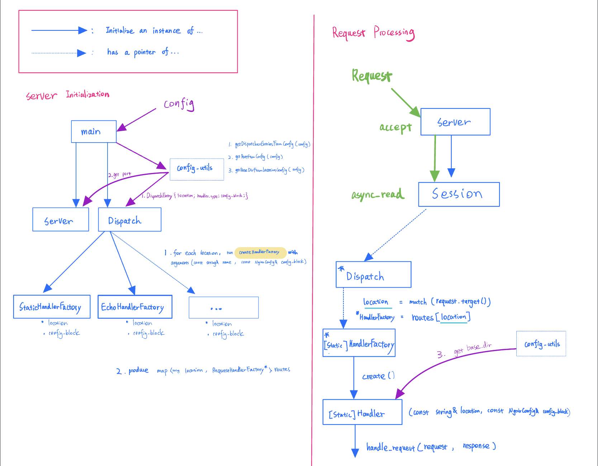

[toc]

# Code Structure Overview

If you need a step-by-step guide on how to add a request handler, see [this](#Adding-a-Handler-Quick-Guide).

The Config format, `RequestHandler` API, and the dispatching mechanism follows the [assignment 6 common API](https://www.cs130.org/assignments/6/#common-api).

This is a high-level overview of the contract of each module. 



### Dispatcher

- Given a location-to-`HandlerFactory` mapping, dispatch incoming requests accordingly to the correct type of `RequestHandler`.

### Server

- For each new connection, create a `Session` Object.

### Session

- Parse incoming http requests, and deliver the request to the `Dispatcher` to get a response.

### RequestHandler

- Always be created for every request by a corresponding long-lived `RequestHandlerFactory`.
- Get important information from the given `NginxConfig` location config.
- Process the request by returning a response.

### Utilities

- General utilities, such as `enum`, `constants`,and reusable functions are places in `util.h`.
- Config Validation functions are placed in `config_utils.h`, scoped by namespace `config_util::`.

# How to Build, Test and Run

1. Build and Run All tests 

   ```bash
   $ mkdir build
   $ cd build
   $ cmake ..
   $ make && make test
   ```

2. Run the server locally

   In the build directory:

   ```bash
   ./bin/server <path to your server config>
   ```

3. Local Docker build

   In base dir:

   ```bash
   $ docker build -f docker/base.Dockerfile -t sudo-rm-rf:base .
   $ docker build -f docker/Dockerfile -t local_run .
   ```

4. Test build on Google cloud

   ```bash
   gcloud builds submit --config docker/cloudbuild.yaml .
   ```


#  Adding a new Handler Guide

Please follow the following steps to add a new request handler:

### Define a `RequestHandler` subclass.

In a new file:

1. Define a new subclass of `RequestHandler`.  The base class is in `RequestHandler.h`.

2. All `RequestHandler` should have a unified constructor:

   ```c++
   NewHandler(const std::string &location, const NginxConfig &config_block);
   ```

   `location`: The request path in the request URL that will be matched to this handler.

   `config_block`: The sub-`NginxObject` that corresponds to the child block in each location config statement.

3.  All `RequestHandler` should override the pure virtual function `handle_request`, that returns a `True/False` status.

Example:

```c++
class StaticRequestHandler : public RequestHandler {
    public:
        StaticRequestHandler(const std::string& location, const NginxConfig& config_block); // In cntr, Fill in the private data by reading the NginxConfig

        status handle_request( const http::request<http::string_body>& request,
        http::response<http::string_body>& response) override;

    private: // Add as many private data needed for processing the request
        std::string request_path_;
        std::optional<std::string> base_dir_ = std::nullopt;
};
```

### Define a corresponding `RequestHandlerFactory`.

In the same file: 

1.  Define a new subclass of `RequestHandlerFactory`. The base class is in `RequestHandlerFactory.h`.
2.  All `RequestHandlerFactory` should override the factory method `create()` that returns a `std::shared_ptr` pointing to a handler instance. 
3. Currently we assume `create()` will not return `null`, i.e. at the level of `RequestHandlerFactory` and `Requesthanlder`, you may assume that the `NginxObject` is semantically valid. However, You will be required to add config validation in `config_util.h`.
4. (However, we recommend defensive programming. You can `return false` in `handle_request` to indicate invalid config).

Example: 

```c++
// Factory
class StaticHandlerFactory : public RequestHandlerFactory {
public:
    StaticHandlerFactory(const std::string &location, const NginxConfig &config_block)
        : RequestHandlerFactory(location, config_block) {}
    std::shared_ptr<RequestHandler> create() {
        return std::make_shared<StaticRequestHandler>(location_, config_block_);
        // location_ and config_block_ are protected data members of the base Factory
    }
};
```

### Unit tests

Before moving on to the next step, you should also have created unit tests for the new pair of `RequestHandler` and `RequestHandlerFactory`.  We recommend adding the unit tests along with the implementation, so that the unit tests serve as a contract specification.

### Register your new `RequestHandler`

1. Add a new `enum HandlerType` value in  `util.h`. For example, `NEW_HANDLER = 4`. 
2. Register the new handler in the `create_hander_factory` function in `dispatcher.cc`.
3. Register your new handler in `GetHandlerTypeFromToken` function in `config_util.cc`. This maps the handler keyword in config to the `enum` value.
4. Register the new handler file and the tests in `CMakelist.txt`. Include the tests in coverage report.

### Add to Config Validation in `config_util`.

If the new handler uses a different location config semantics (e.g. additional keywords; additional required statement), you may need to add config validation logic to the helper function `ValidateLocationBlock` in `config_util.h`.

The signature of the `ValidateLocationBlock` is:

```c++
bool ValidateLocationBlock(NginxConfig location_config, HandlerType type);
```

`location_config`: The sub-`NginxObject` that corresponds to the child block in the location statement.

`type`: The `enum HandlerType` registered in `Util.h`.

example: 

```c++
bool ValidateLocationBlock(NginxConfig location_config, HandlerType type){
    switch (type) {
    case UNDEFINED_HANDLER:
        return false;
        break;
    case STATIC_HANDLER: // Validate the location config for your new handler.
        if(!config_util::getBaseDirFromLocationConfig(location_config).has_value()){
            return false;
        }
        break;
    default:
        break;
    }
    return true;
}
```

### Integration Tests

Finally, add some Integration Tests. Some important information to know:

1. All integration test scripts reside in `tests/integration_tests`.
2. When running `make`, cmake will copy all the files recursively in `integration_tests` to the build directory. Running `ctest` will run the integration tests.


## Questions?

If you have questions, please feel free to contact us to ask questions or schedule a meeting.

Good Luck! :)