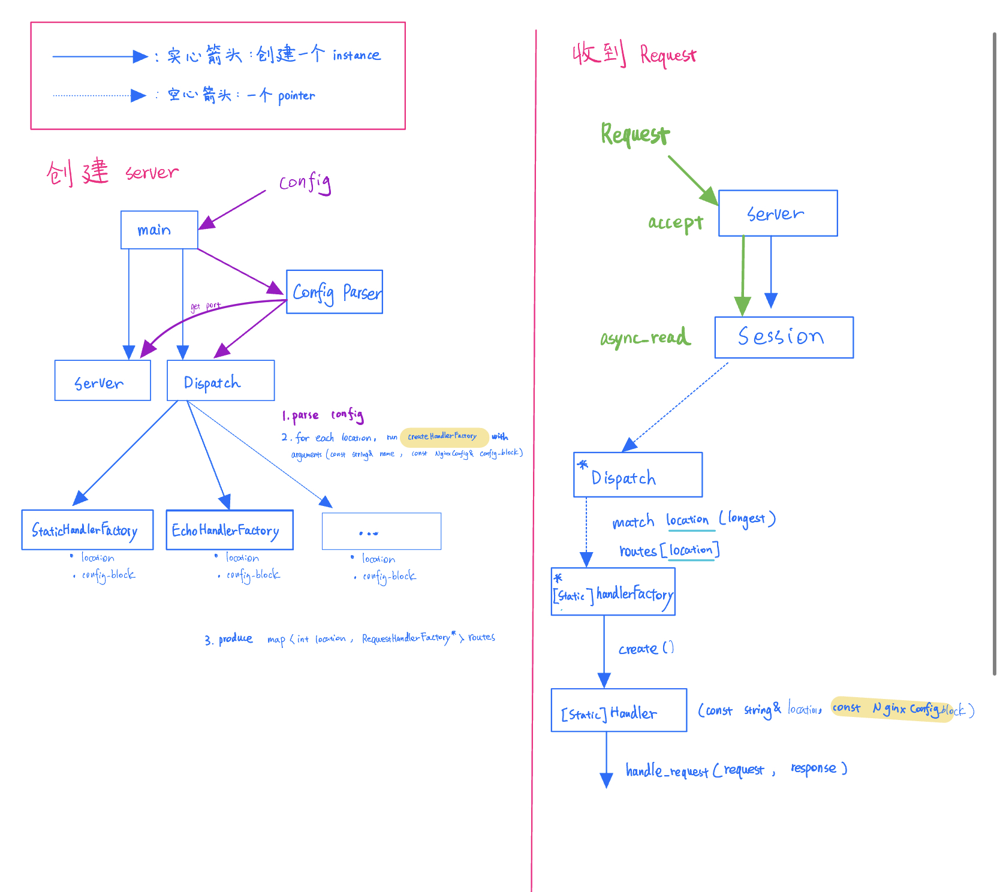

# Design Doc





### Config Parser

1. change config parser to follow config file format:
   - location-major typed
   - Explicit names for arguments for each handler withtin the block
   - location keyword
   - Support relative paths


### Dispatch

1. Get the parsed config file

   - so we get each locations, their type, and the config object in the block

   - ```
     location /static StaticHandler {
       root ./files # supports relative paths
     }
     ```

   - In this case, `/static` is location, `StaticHandler` is type, and `{root ./files }` is config block

2. Create HandlerFactorys for each `location` in config file

   ```c++
   RequestHandlerFactory* createHandlerFactory(const string& name, const NginxConfig& config_block)
   ```

3. Generate a Map called `routes`  from `location` to pointers to `RequestHandlerFactory`

   ```c++
   map<string location, RequestHandlerFactory*> routes;
   ```

4. have method `match` which takes `routes` and `request.target()` for longest path matching

   ```c++
   RequestHandlerFactory* Dispatch::match(const string& request_url)
   ```

   


### RequestHandlerFactory

1. Takes in `location` and `config`

   ```c++
   RequestHandlerFactory(const string& location, const NginxConfig& config_block)
   ```

2. have method `create()` with no argument, which create an instance of `StaticHandler`

   ```c++
   std::shared_ptr<RequestHandler> RequestHandlerFactory::create()
   // construct an instance like that
   public RequestHandler(const string& location, const NginxConfig& config_block);
   ```

   

### RequestHandler

1. Takes in `location` and `config`, parse `config` into root file path

   ```c++
   public RequestHandler(const string& location, const NginxConfig& config_block);
   ```

2. Define status (enum?)

   ```c++
   typedef boolean status; // maybe also an enum or struct with error message?
   ```

3. have a method `handle_request(request, response)`

   ```c++
   virtual status handle_request(
     			const http::request<http::string_body>& request,
           http::response<http::string_body>& response)
   ```

   

### Utils

1. get `Port Number`?


# Run coverage test
```
$ mkdir build_coverage
$ cd build_coverage
$ cmake -DCMAKE_BUILD_TYPE=Coverage ..
$ make coverage
```
The report is in `build_coverage/report/index.html`

# Run all tests (unittests + integration tests)
```
$ mkdir build
$ cd build
$ cmake ..
$ make && make test
```

# Run integration test script
```
$ cp build/bin/server tests/integration_tests
$ cd tests/integration_tests
$ ./integration.sh -c ./server
```
Or
```
$ cd build/bin
$ ./integration.sh -c ./server
```